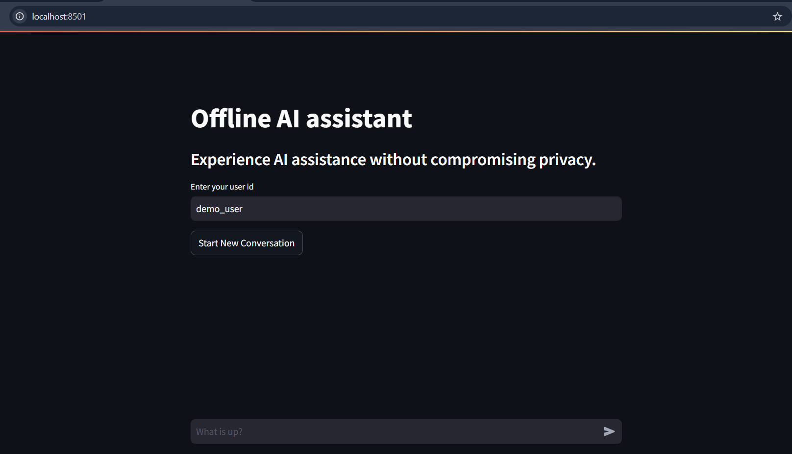

# llama_chatbot 🚀🤖

Welcome to **llama_chatbot**, your offline-powered language model chatbot! Built with cutting-edge technology, this app leverages **Ollama** and the **llama.3 billion dataset** to provide you with fast, reliable, and secure conversational AI capabilities—all **without needing an internet connection**. 🌐❌

## Features 🌟
- **Completely Offline**: Enjoy smooth, secure chats without any reliance on the cloud.
- **Powered by Ollama**: Uses the powerful Ollama framework for seamless language processing.
- **Llama.3 Billion Dataset**: Trained on an extensive dataset for smarter, more natural conversations.
- **Interactive UI**: Built with **Streamlit** to give you an intuitive and user-friendly experience.

## Demo:




## Installation 🔧
Getting started is easy! Follow these steps to set up **llama_chatbot** on your machine:

### 1. Install Ollama 🛠️
You need to install **Ollama** to get started with the application. Follow the official instructions on [Ollama’s website](https://ollama.com).

### 2. Install Required Dependencies 📦
Make sure you have all the necessary Python packages by running:

```bash
pip install -r requirements.txt
```

### 3. Run the Chatbot 🗣️
To launch the chatbot, simply run:

```bash
streamlit run Chat_bot.py
```

Now you’re ready to start chatting with your offline-powered AI assistant!

## Usage 💬
Once up and running, you can interact with the chatbot right from your browser. Type your questions or commands, and let the model work its magic—quick, offline, and hassle-free.

## Contributing 🤝
Feel free to fork, clone, or submit pull requests to help make **llama_chatbot** even better! Contributions are always welcome.

## Credits

Thank you https://github.com/laxmimerit/ for the awesome course and resources.